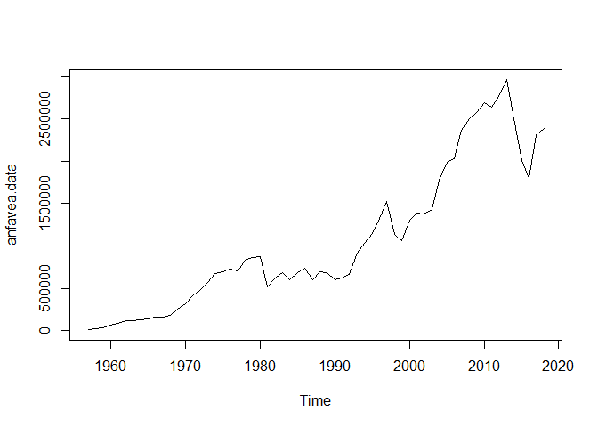
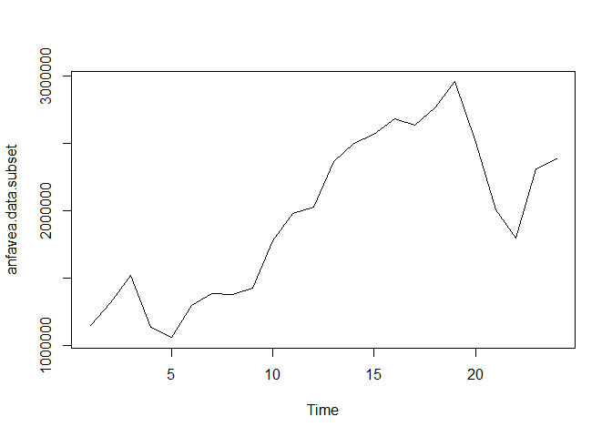
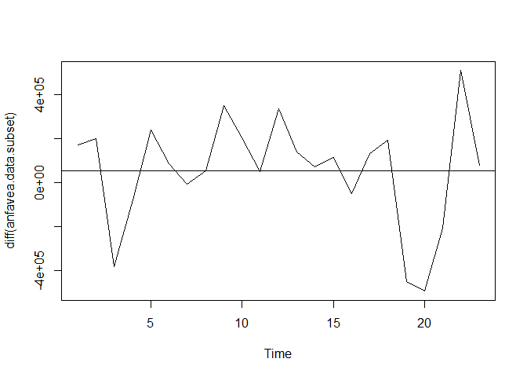
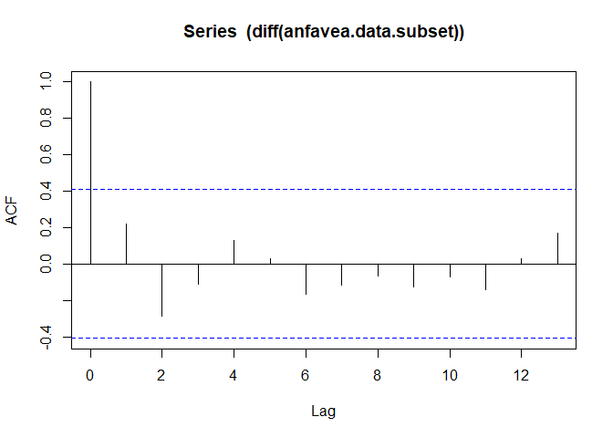
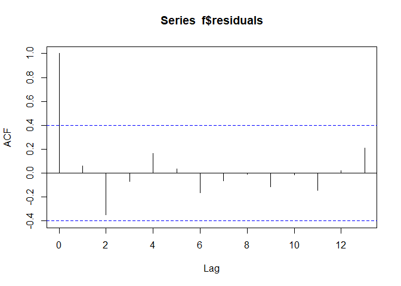
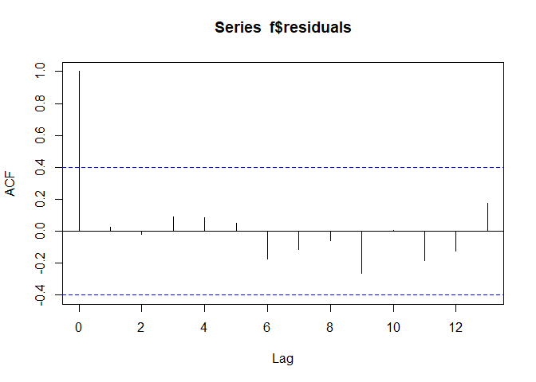
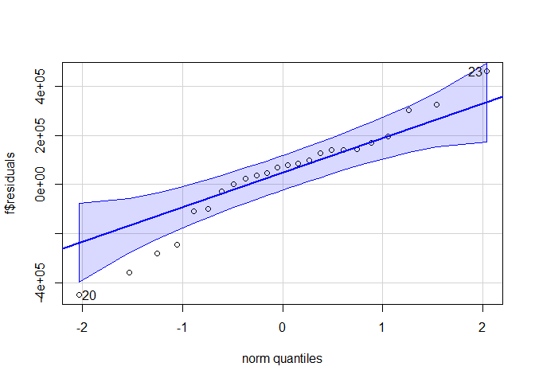
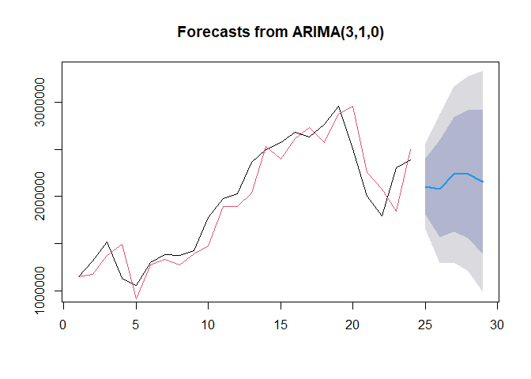

ANFAVEA\_arima\_fit.R
================
GPP2
2022-05-01

``` r
## load libraries
library(car)
library(forecast)
library(rmarkdown)
#load data
anfavea.data <- read.csv2('D:/pedro/GITHUB/classes_projects/time_series/data/automoveismontadosanfavea.csv') 
colnames(anfavea.data) <- c('dates', 'auto_production', 'x')
anfavea.data <- anfavea.data[,1:2]
#ts trasnform
anfavea.data <- ts(anfavea.data[,2], freq = 1, start = 1957)
ts.plot(anfavea.data)
```

<!-- -->

``` r
#subset anfavea data
anfavea.data.subset <- anfavea.data[39:62]
ts.plot(anfavea.data.subset)
```

<!-- -->

``` r
#auto.arima ajusted model with lag 1 difference
f<- auto.arima(anfavea.data.subset);f
```

    ## Series: anfavea.data.subset 
    ## ARIMA(0,1,0) 
    ## 
    ## sigma^2 = 6.156e+10:  log likelihood = -318.33
    ## AIC=638.67   AICc=638.86   BIC=639.8

``` r
#Visual check of lag1 difference properties
#plot lag 1 diff
ts.plot(diff(anfavea.data.subset))
#mean line
abline(h = mean(diff(anfavea.data.subset)))
```

<!-- -->

``` r
#Autocorrelation of lag 1 difference - looks good
acf((diff(anfavea.data.subset)))
```

<!-- -->

``` r
#try 1
f <- Arima(anfavea.data.subset, order = c(1,1,0)) ; f
```

    ## Series: anfavea.data.subset 
    ## ARIMA(1,1,0) 
    ## 
    ## Coefficients:
    ##          ar1
    ##       0.2451
    ## s.e.  0.1994
    ## 
    ## sigma^2 = 6.025e+10:  log likelihood = -317.61
    ## AIC=639.21   AICc=639.81   BIC=641.48

``` r
acf(f$residuals)
```

<!-- -->

``` r
#try 2
f <- Arima(anfavea.data.subset, order = c(2,1,0)) ; f
```

    ## Series: anfavea.data.subset 
    ## ARIMA(2,1,0) 
    ## 
    ## Coefficients:
    ##          ar1      ar2
    ##       0.3269  -0.3829
    ## s.e.  0.1923   0.2052
    ## 
    ## sigma^2 = 5.434e+10:  log likelihood = -316.04
    ## AIC=638.08   AICc=639.34   BIC=641.49

``` r
acf(f$residuals) #looks good
```

<!-- -->

``` r
#try 3
f <- Arima(anfavea.data.subset, order = c(3,1,0)) ; f
```

    ## Series: anfavea.data.subset 
    ## ARIMA(3,1,0) 
    ## 
    ## Coefficients:
    ##          ar1      ar2     ar3
    ##       0.4165  -0.5101  0.2593
    ## s.e.  0.2063   0.2291  0.2469
    ## 
    ## sigma^2 = 5.386e+10:  log likelihood = -315.52
    ## AIC=639.05   AICc=641.27   BIC=643.59

``` r
acf(f$residuals) #looks good
```

<!-- -->

``` r
#try 4
f <- Arima(anfavea.data.subset, order = c(3,2,0)) ; f
```

    ## Series: anfavea.data.subset 
    ## ARIMA(3,2,0) 
    ## 
    ## Coefficients:
    ##           ar1      ar2      ar3
    ##       -0.4157  -0.7109  -0.4287
    ## s.e.   0.1992   0.1792   0.2383
    ## 
    ## sigma^2 = 6.13e+10:  log likelihood = -303.7
    ## AIC=615.39   AICc=617.74   BIC=619.76

``` r
acf(f$residuals) #
```

<!-- -->

``` r
#select try 3 based on AIC, AICc and BIC
f <- Arima(anfavea.data.subset, order = c(3,1,0)) ; f
```

    ## Series: anfavea.data.subset 
    ## ARIMA(3,1,0) 
    ## 
    ## Coefficients:
    ##          ar1      ar2     ar3
    ##       0.4165  -0.5101  0.2593
    ## s.e.  0.2063   0.2291  0.2469
    ## 
    ## sigma^2 = 5.386e+10:  log likelihood = -315.52
    ## AIC=639.05   AICc=641.27   BIC=643.59

``` r
acf(f$residuals) #looks good
```

<!-- -->

``` r
#check fi remains auto correlation
Box.test(f$residuals, lag=15, fitdf=4)
```

    ## 
    ##  Box-Pierce test
    ## 
    ## data:  f$residuals
    ## X-squared = 5.4398, df = 11, p-value = 0.908

``` r
#Check residual distribuition
qqPlot(f$residuals) #hmm, not that good
```

<!-- -->

    ## [1] 20 23

``` r
#
plot(forecast(f,5))                   
lines(fitted(f), col=2) #terrible
```

<!-- -->
